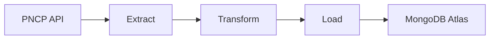

# Projeto de Engenharia de Dados ETL - Integração com PNCP API

## Proposta do projeto

Esta entrega implementa um pipeline ETL que consome a PNCP API pública,
normaliza os registros retornados e os armazena no MongoDB Atlas.

O projeto foca em metadados da administração pública, iniciando com:

- busca de organizações por razão social;
- enriquecimento de detalhes da organização por CNPJ;
- extração de unidades para cada organização;
- persistência de dados brutos e processados no MongoDB Atlas.

Documentação da PNCP API:
https://pncp.gov.br/api/pncp/swagger-ui/index.html

## Arquitetura da solução

A solução segue um desenho ETL orientado a objetos:

- `Extract`: responsável por chamar a PNCP API;
- `Load`: responsável por persistir dados no MongoDB Atlas;
- `ETLPipeline`: coordena o fluxo completo.



## Etapas do fluxo de dados

### 1. Extract

O pipeline consulta o endpoint da PNCP para organizações usando o termo de busca
configurado no ambiente ou o valor padrão `Prefeitura`.

Após a busca, cada organização é enriquecida pelo endpoint de CNPJ e
suas unidades são coletadas pelo endpoint de unidades.

### 2. Transform

Os documentos JSON retornados são normalizados para estruturas adequadas à
análise e persistência:

- nomes de campos são padronizados em snake_case;
- dados aninhados são achatados quando útil;
- o payload original é preservado em `raw_payload`.

### 3. Load

Os documentos transformados são armazenados nas coleções do MongoDB Atlas:

- `orgaos`
- `unidades`
- `etl_runs`

A etapa de carga usa semântica de upsert para manter o pipeline idempotente.

## Instruções de execução

### 1. Criar e ativar o ambiente virtual

```bash
python3 -m venv .venv
source .venv/bin/activate
```

### 2. Instalar dependências

```bash
pip install -r requirements.txt
```

### 3. Configurar variáveis de ambiente

Use um arquivo local `.env`:

```bash
cp .env.example .env
```

Edite o `.env` e **substitua `MONGODB_URI`** pela sua string real de conexão do MongoDB Atlas:

```dotenv
# MongoDB Atlas
MONGODB_URI="mongodb+srv://<user>:<password>@<cluster>/<options>"
MONGODB_DATABASE="pncp"

# PNCP API
PNCP_BASE_URL="https://pncp.gov.br/api/pncp"
PNCP_SEARCH_TERM="Prefeitura"
PNCP_PAGE="1"
PNCP_PAGE_SIZE="10"
PNCP_MAX_PAGES="1"

# Logging
ETL_LOG_LEVEL="INFO"
```

Se preferir exports no shell em vez de `.env`:

```bash
export MONGODB_URI="mongodb+srv://<user>:<password>@<cluster>/<options>"
export MONGODB_DATABASE="pncp"
export PNCP_BASE_URL="https://pncp.gov.br/api/pncp"
export PNCP_SEARCH_TERM="Prefeitura"
export PNCP_PAGE="1"
export PNCP_PAGE_SIZE="10"
export PNCP_MAX_PAGES="1"
export ETL_LOG_LEVEL="INFO"
```

### 4. Executar o ETL

```bash
python src/main.py
```

O script imprime um resumo com a quantidade de registros extraídos e carregados.

## Estrutura do projeto

- `src/extract.py`: cliente da PNCP API;
- `src/load.py`: camada de persistência no MongoDB Atlas;
- `src/main.py`: orquestração do ETL;
- `requirements.txt`: dependências Python;
- `README.md`: documentação do projeto.

## Padrões de código

A implementação segue os requisitos da disciplina:

- programação orientada a objetos;
- docstrings nos métodos desenvolvidos;
- formatação compatível com Black;
- persistência no MongoDB Atlas.

## Observações

- Não versione a pasta de ambiente virtual (`.venv`).
- A implementação atual usa endpoints públicos da PNCP que não exigem
  autenticação para o fluxo descrito.